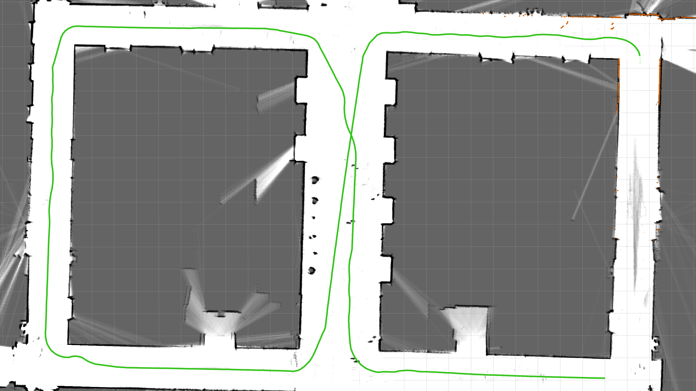

# ld06 localization example

## 实现的功能
当目标区域内的地图已经被建立，我们可以使用该地图作为参考对激光雷达进行实时定位。  
rviz默认显示加载的全局地图和实时建立的全局地图  
rviz默认显示定位轨迹点
实时定位通过lcm广播  
本节不考虑输出定位的可信度。定位输出的频率为20hz.    
`cartographer_ros`支持输出程序各阶段各种实时参数，包括局部匹配scores, 全局匹配scores, 约束数量, 匹配算法的延时等。更多细节请参考[metrics_test](metrics_test.md)。在这些输出参数中，并没有任何参数能够直观反映实时全局定位的可信度。  
为了实时计算定位可信度，需要后续在cartographer中添加正向计算实时点云匹配到全局地图上的score并输出。

## 实现的方式
在`rviz`节点中加载`localization_2d.rviz`实现定制化的rviz显示。  
新增`odometer_publisher`节点。该节点以20hz的频率查询tf坐标系统中`horizontal_laser_link`到`odmo`的坐标变换并以`position::pose_2d`格式通过`lcm`发送给控制端。

## 使用方法
1. 使用rosbag回放定位  
    启动`ld06_localization.launch`
    ```
    roslaunch cartographer_ros ld06_localization.launch bag_filename:='${DATA}/ld06/taiyanggong_f10_2020_10_29.bag' load_state_filename:='${DATA}/ld06/taiyanggong_f10_2020_10_29.bag.pbstream’
    ```
2. 使用实时激光雷达定位  
    注释掉`ld06_localization.launch`的`line24` 到 `line28`.
    ```
      <!-- <param name="/use_sim_time" value="false" />
  <node name="cartographer_dev_rosbag_publisher" pkg="cartographer_ros"
      type="cartographer_dev_rosbag_publisher" args="
          -bag_filename $(arg bag_filename)"
      output="screen"/> -->
    ```
    启动`ld06_localization.launch`  
    ```
    roslaunch cartographer_ros ld06_localization.launch  load_state_filename:='${DATA}/ld06/taiyanggong_f10_2020_10_29.bag.pbstream’
    ```

## 结果


## 注意事项
1. 本定位算法默认初始定位点为地图坐标原点。因此以地图中的坐标原点附近作为出发点将缩短局部地图定位到全局地图上的时间。
2. 本定位算法在遇到遮挡严重，点云稀疏或者精度降低等情况是，可能会出现定位位置的跳变。
3. 本定位算法未实现定位精度的输出。