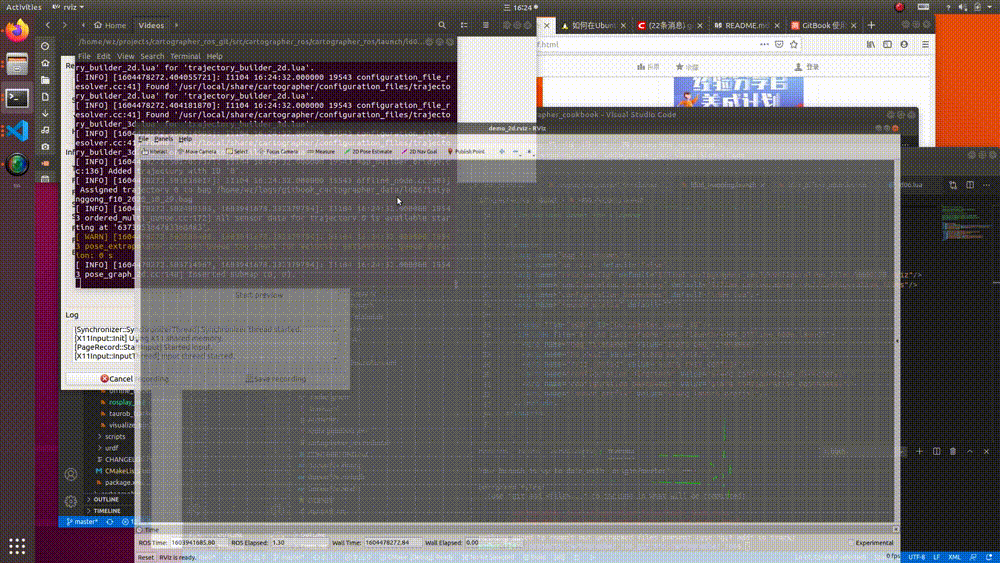

# ld06 mapping example

## 实现的功能
为了制作某一个区域的地图，我们需要事先录制该区域的点云rosbag.通过`ld06_mapping.launch`离线建图，最终该区域pbstream格式的地图将被生成。  
为了简化建图的难度，降低本节的难度。本节限定

1. 建图的原始数据只使用单个单线激光雷达的数据，数据格式为ros中的标准激光雷达格式`sensor_msgs/LaserScan`。
2. 建图过程中不使用imu或者gps等辅助传感器，单纯依靠点云拼接建图。
3. 建图区域为室内，几何特征明显且稳定的区域，录制时候的移动平台能够慢速平稳运行。

## 使用方法
```
roslaunch cartographer_ros ld06_mapping.launch bag_filenames:='${DATA}/ld06/taiyanggong_f10_2020_10_29.bag'
```

其中`taiyanggong_f10_2020_10_29.bag`为输入的rosbag文件，输出地图为同目录下的：`taiyanggong_f10_2020_10_29.bag.pbstream`

## 结果


## 注意事项
1. 关于调参。  
    在测试期间，我们尝试改变`my_ld06.lua`中的配置参数，以增加cartographer的局部与全局建图的准确度，比如：  
    ```
    -- TRAJECTORY_BUILDER_2D.real_time_correlative_scan_matcher.linear_search_window = .2
    -- TRAJECTORY_BUILDER_2D.real_time_correlative_scan_matcher.translation_delta_cost_weight = 2.
    -- TRAJECTORY_BUILDER_2D.real_time_correlative_scan_matcher.rotation_delta_cost_weight = 1.

    -- POSE_GRAPH.optimization_problem.huber_scale = 0.5
    -- POSE_GRAPH.optimize_every_n_nodes = 25
    -- POSE_GRAPH.constraint_builder.min_score = 0.65

    -- POSE_GRAPH.constraint_builder.max_constraint_distance = 3.0
    -- POSE_GRAPH.constraint_builder.fast_correlative_scan_matcher.linear_search_window = 8.0
    -- POSE_GRAPH.constraint_builder.fast_correlative_scan_matcher.angular_search_window = 20.0
    ```
    最终我们并没有找到一套比默认参数更合适的值，能够让建图的速度或者精度有肉眼可见的提高。  
    更准确的建图可能依赖后续对[结果评估](https://google-cartographer.readthedocs.io/en/latest/evaluation.html)的深入学习，对[添加里程计](https://google-cartographer-ros.readthedocs.io/en/latest/going_further.html)等传感器方法的学习。
2. 关于建图。  
    受限于数据源单一，参数未调优，本节的建图方法不适合大片空旷，或者超长长廊等特征单一的区域。
    思岚科技给出了一些[建图技巧](https://www.sohu.com/a/289912352_447946),对提高建图质量有较大帮助。