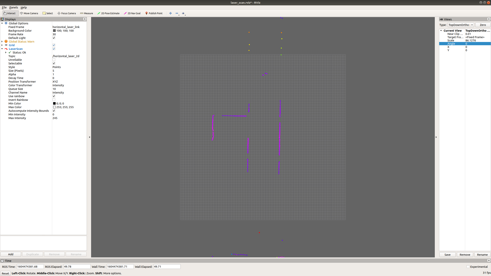

# rosplay use current time

## 实现的功能

在日志回放过程中，存在日志录制的时间戳与日志回放的时间戳不一致的矛盾。  
ros官方对此给出了[解释与解决方案](http://wiki.ros.org/Clock)  
当传感器的日志数据被回放时，数据的时间戳为录制时刻的，是很久以前的。cartographer算法在实时计算过程中会得出实时计算结果，比如当前帧到sunmap的坐标变换tf.当带有实时时间戳的tf与历史时间戳的当前帧数据同时发送给rviz显示的时候，rviz会自动舍弃掉旧的当前帧，造成当前帧无法显示。

cartographer_ros 默认的日志回放方式与ros官方建议的一致， 即在回放rosbag的时候添加`--clock`参数，同时将`/use_sim_time`设置为` true`。

由于在回放模式里需要将`/use_sim_time`设置为` true`，在实时模式里需要将`/use_sim_time`设置为` false`,因此`rosplay_use_current_time`提供了另外一种解决方案，使得`/use_sim_time`可以保持默认值`false`.  

`rosplay_use_current_time`直接将rosbag里每条消息的自带时间戳修改为系统当前时间戳，并且保持相邻消息直接的顺序，时间间隔与消息记录的时候一致。对于消息订阅方而言，`rosplay_use_current_time`消除了回放模式与实时模式的时间戳差异。

## 实现的方式
`cartographer_ros`的`dev`模块里已经为我们提供了`rosbag_publisher_main.cc`文件，并且被编译为`cartographer_dev_rosbag_publisher`可执行文件。为了方便使用，我们提供了对应的launch文件`rosplay_use_current_time.launch`。该文件启动了rviz节点，加载了`laser_scan.rviz`配置文件，使得rviz能够默认订阅`horizontal_laser_2d`; 该文件还启动了`cartographer_dev_rosbag_publisher`节点， 传入参数`bag_filename`是必须的,为需要播放的rosbag文件路径。

## 使用方法
```
roslaunch cartographer_ros rosplay_use_current_time.launch bag_filename:=${DATA}/ld06/taiyanggong_f10_2020_10_29.bag
```


## 结果


## 注意事项
`/use_sim_time`为ros的全局参数，设置方式为：  
```
rosparam set /use_sim_time true
```  
或者  
```
rosparam set /use_sim_time false
```   
设置rosbag提供日志时间的方式为   
```
rosbag play --clock ${your bag}
```  


|use_sim_time|rosbag|`ros::Time::now()`|
|-|-|-|
|false|~~--clock~~|系统时间|
|false|--clock|系统时间|
|true|~~--clock~~|0|
|true|--clock|日志时间|